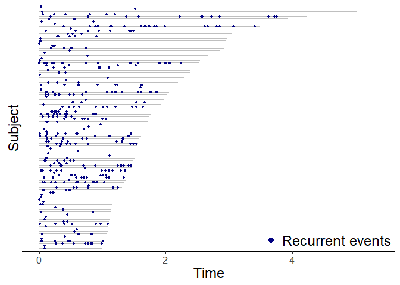
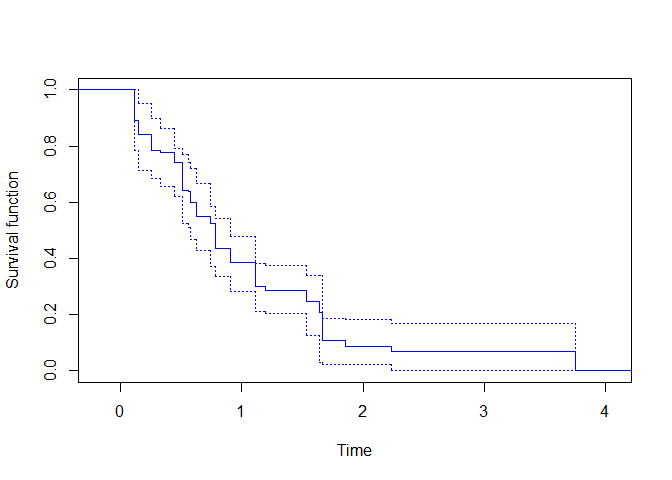

<!-- README.md is generated from README.Rmd. Please edit that file -->

# RecurrenceEnd

<!-- badges: start -->
<!-- badges: end -->

The goal of RecurrenceEnd is to implement several non-parametric methods
for estimating the distribution of the unobservable terminating event of
a recurrentevent process.

## Installation

You can install the development version of RecurrenceEnd from
[GitHub](https://github.com/) with:

``` r
# install.packages("devtools")
devtools::install_github("anikoszabo/RecurrenceEnd")
```

## Example

``` r
library(RecurrenceEnd)
#> Loading required package: reda
#> Loading required package: survival
#> Warning: package 'survival' was built under R version 4.3.3
```

The `SimulatedData` data set contains simulated recurrent events for 97
subjects. The recurrent events continue until an unobserved end-time,
when they stop. The goal is to estimate the distribution of the
unobserved end-time across the subjects.

The data has one row for each occurrence of the recurrent event within a
subject, and a last row for the follow-up time during which no
additional events have occurred. The following table shows data from 3
subjects with varying numbers of recurrent events. The ‘time’ variable
records the event/last follow-up time, the ‘indicator’ distinguishes
between events (1) and last follow-up (0), while Z.1 and Z.2 are
covariates that affect the rate of the recurrent event process.

``` r
SimulatedData[SimulatedData$patient.id %in% c(5,6,7),]
#>    patient.id       time indicator Z.1        Z.2
#> 9           5 0.11015772         1   1 0.04779898
#> 10          5 2.58148406         0   1 0.04779898
#> 11          6 0.05351576         1   0 0.98247007
#> 12          6 0.07074261         1   0 0.98247007
#> 13          6 0.23804787         1   0 0.98247007
#> 14          6 0.24731123         1   0 0.98247007
#> 15          6 2.05339473         0   0 0.98247007
#> 16          7 0.03134527         1   0 1.01133452
#> 17          7 0.07553212         1   0 1.01133452
#> 18          7 0.08562227         1   0 1.01133452
#> 19          7 0.26163282         1   0 1.01133452
#> 20          7 1.23582969         0   0 1.01133452
```

We can visualize the data to get a better understanding of its
structure. In the plot, each gray line represents the follow-up of a
patients, with the blue points showing the occurrences of the recurrent
event in that patient. We can see that for some subjects the recurrent
events seem to keep going until the last follow-up time (and likely
beyond it as well), while for others there is a long stretch of
follow-up time without any recurrent events, indicating that the
unobserved ending event has probably happened.

``` r
library(reReg) # for plotting recurrent event data
#> Warning: package 'reReg' was built under R version 4.3.3
plotEvents(Recur(time=time, id=patient.id, event=indicator) ~ 1,
           data=SimulatedData, 
           control=list(cex=1, width=0.2, recurrent.color="navy")) 
```



This package implements four methods for estimating the distribution of
the unobserved end-time. The NPMLE method is recommended, the others are
ad-hoc methods implemented for comparison.

``` r
res_np <- estimate_end(Recur(time=time, id=patient.id, event=indicator) ~ Z.1+Z.2, 
                       data = SimulatedData, bootCI = TRUE, bootB = 100)

plot(res_np, col="blue", conf.int = TRUE, conf.lty=3, conf.col="blue")
```



The values at specific time-points can be obtained using the `predict`
function, while quantiles can be extracted using the `quantile` and
`median` functions.

``` r
# probability of ongoing recurrent events at time = 1
predict(res_np, times=1, conf.int = TRUE)
#> $time
#> [1] 1
#> 
#> $pred
#> [1] 0.2395833
#> 
#> $lower
#> [1] 0.1666667
#> 
#> $upper
#> [1] 0.3125

# median ending time
median(res_np, conf.int=TRUE)
#> $quantile
#>       50 
#> 0.516364 
#> 
#> $lower
#>        50 
#> 0.3878086 
#> 
#> $upper
#>        50 
#> 0.7548213
```
